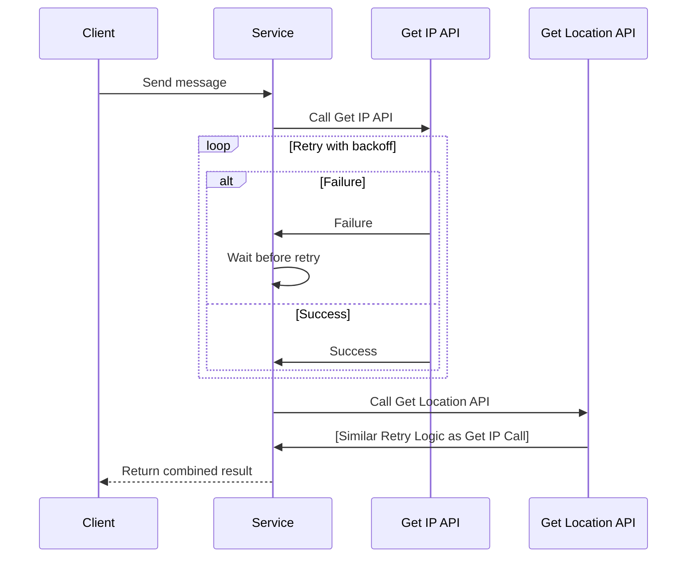
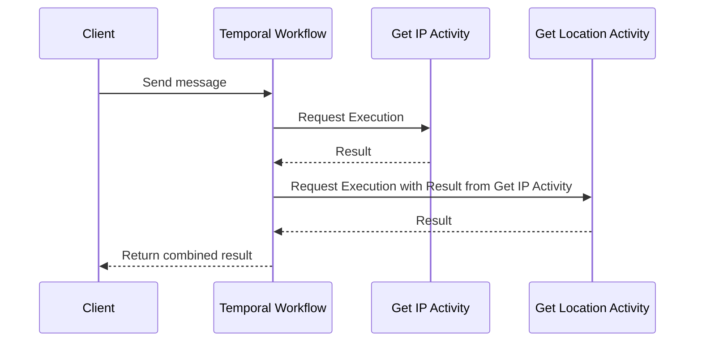

## Before Temporal

```mermaid
sequenceDiagram
participant Client
participant Service
participant Get_IP_API as Get IP API
participant Get_Loc_API as Get Location API

Client->>Service: Send message
Service->>Get_IP_API: Call Get IP API
loop Retry with backoff
alt Failure
Get_IP_API->>Service: Failure
Service->>Service: Wait before retry
else Success
Get_IP_API->>Service: Success
end
end
Service->>Get_Loc_API: Call Get Location API
Get_Loc_API->>Service: [Similar Retry Logic as Get IP Call]
Service-->>Client: Return combined result
```

## After Temporal 

Here's the simplified diagram:

```mermaid
sequenceDiagram
participant Client
participant Workflow as Temporal Workflow
participant Get_IP_Activity as Get IP Activity
participant Get_Loc_Activity as Get Location Activity

Client->>Workflow: Send message
Workflow->>Get_IP_Activity: Request Execution
Get_IP_Activity-->>Workflow: Result
Workflow->>Get_Loc_Activity: Request Execution with Result from Get IP Activity
Get_Loc_Activity-->>Workflow: Result

Workflow-->>Client: Return combined result
```